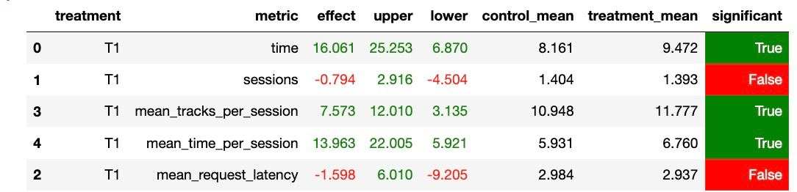

# Отчёт
### Основные идеи и детали
- Пытался играться с другими лоссами, как это было сказанно на лекции о нейросетевых подходах, не вышло.
- Попробывал добавлять новые сущности в класс (артистов, чтобы советовать смежные песни), подход оказался неудачным
- Решил сменить операцию скалярного произведения на cosine-sim. На удивление сработало, попробывал поиграться с другими операциями, получил полнейший провал
- Попробывал играться с гиперпараметрами модели (lr, scheduler, weight_decay) - проиграл

В итоге помог подход с изменением скалярного произведения.

